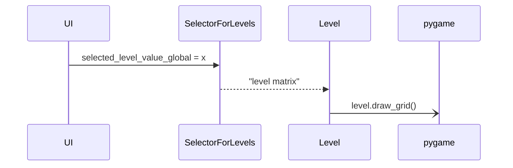

# Arkkitehtuuri

## Rakenne
Ohjelman suoritus tapahtuu kolmella python tiedostolla. index.py käynnistää ja hallinnoi ohjelmaa, levelselect.py käynnistää käyttöliittymän ja palauttaa valitun tason ja level.py sisältää funktioita joilla tasoa piirretään. 

