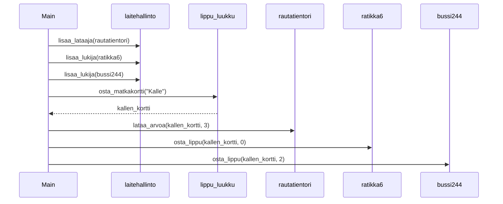

## Tehtävä 2

```mermaid
 sequenceDiagram
    Main->>laitehallinto: lisaa_lataaja(rautatientori)
    Main->>laitehallinto: lisaa_lukija(ratikka6)
    Main->>laitehallinto: lisaa_lukija(bussi244)
    Main->>lippu_luukku: osta_matkakortti("Kalle")
    lippu_luukku-->>Main: kallen_kortti
    Main->>rautatientori: lataa_arvoa(kallen_kortti, 3)
    Main->>ratikka6: osta_lippu(kallen_kortti, 0)
    Main->>bussi244: osta_lippu(kallen_kortti, 2)   
```

