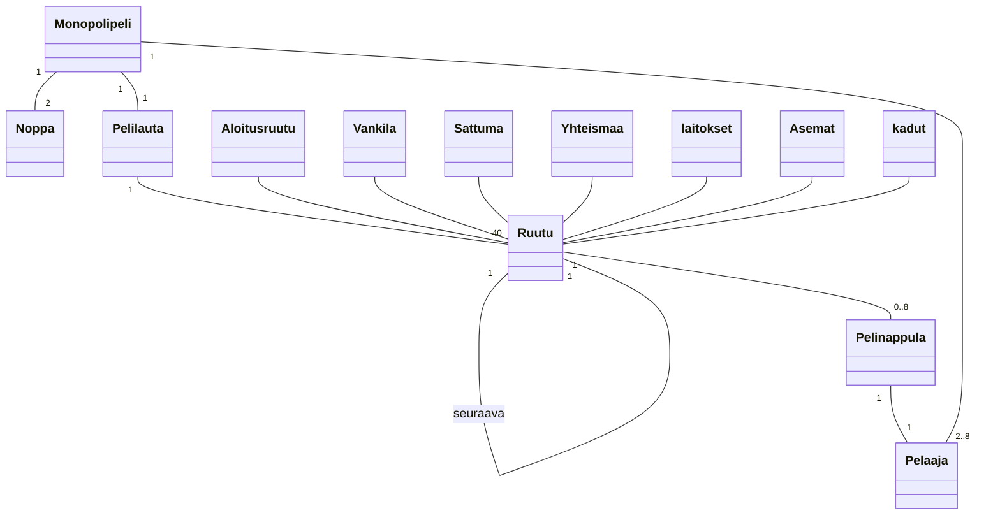

## Monopoli, alustava luokkakaavio

```mermaid
 classDiagram
    Monopolipeli "1" -- "2" Noppa
    Monopolipeli "1" -- "1" Pelilauta
    Pelilauta "1" -- "40" Ruutu
    Ruutu "1" -- "1" Ruutu : seuraava
    Ruutu "1" -- "0..8" Pelinappula
    Pelinappula "1" -- "1" Pelaaja
    Pelaaja "2..8" -- "1" Monopolipeli
    Aloitusruutu -- Ruutu
    Vankila -- Ruutu
    Sattuma -- Ruutu
    Yhteismaa -- Ruutu
    laitokset -- Ruutu
    Asemat -- Ruutu
    kadut -- Ruutu   
```
